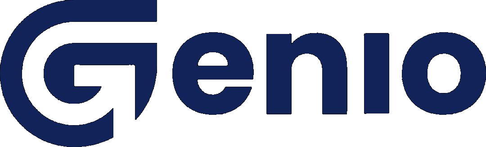
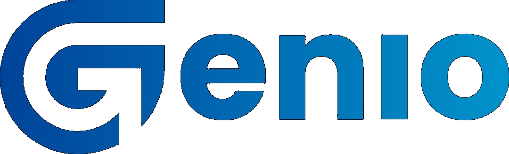
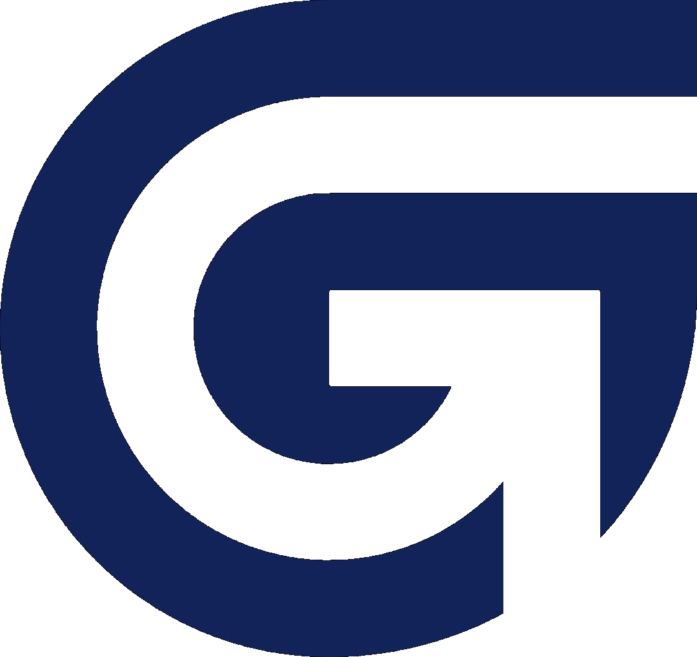

# Genio Brand Visual Template — Revised Spec

> **Purpose:** A reusable, prompt-ready specification for all Genio slide decks. Governs background gradients, typography, components, and logo usage. Updated June 2026 — replaces the original Mode A gradient and adds logo/icon asset library.

---

## 1. The one-paragraph brief (prompt-ready)

> Design a 16:9 slide template (1920×1080 px) for **Genio — Spesialis Pembersih Kerak**. The visual identity uses only blues and one accent yellow. Pages are either **clean diagonal-gradient blue** (used for cover, section dividers, content-heavy dark slides) or **near-white with a faint top-left blue gradient wash** (used for detail slides with photos, lists, and chips). Every page carries the vertical sidebar mark **"Genio Brand Guideline"** rotated 90° on the far-left edge with a thin vertical line above it, and a *small italic Poppins-Light page number* in the bottom-right corner. Display typography is **Bebas Neue Bold** (very tight, condensed, all caps, charSpacing 0); body is **Poppins** (Regular for body, SemiBold for sub-heads, Light-Italic for page numbers, Medium for labels). Section dividers use a giant outlined Bebas number (e.g. `01.`) sitting *above* a solid Bebas section title. Content slides pair a big solid-Bebas Indonesian-blue title with **rounded-rectangle photo frames** (radius ≈ 24 px) on one side and justified Poppins body text on the other. UI chips are **outlined pill shapes** in deep blue, never filled. Avoid corporate gradients, drop shadows on text, glassmorphism, gradient text, neon, sci-fi tropes. The mood is **clean, technical, calm, slightly editorial** — closer to a Muji catalog than a startup pitch deck.

---

## 2. Two-mode background system

### Mode A — "Hero Blue" ✦ REVISED
Used on: cover, all section-divider slides, dense brand-statement slides.

**Gradient direction:** bottom-left → top-right (i.e. `to top right` in CSS).

| Stop | Position | Hex | Role |
|---|---|---|---|
| 0 | 0% (bottom-left) | `#1AB3E8` | Bright sky-blue — the lightest, most vibrant corner |
| 1 | 25% | `#0193CC` | Brand Bright Blue |
| 2 | 60% | `#004499` | Brand Deep Blue |
| 3 | 100% (top-right) | `#0D1A45` | Near-navy — the darkest corner |

**CSS:**
```css
background: linear-gradient(to top right,
  #1AB3E8 0%,
  #0193CC 25%,
  #004499 60%,
  #0D1A45 100%
);
```

**Texture:** ❌ None. No paper-grain, no noise overlay. Clean smooth gradient only.

**Text color on Mode A:** `#FFFFFF` or `#F5F5F5`.

**Outlined numerals on Mode A:** thin stroke 1.5 px, white, no fill.

**Thin divider strip (cover & TOC only):** 4 px horizontal rule at `rgba(10, 21, 53, 0.6)` at the bottom edge.

### Mode B — "Paper White"
Used on: content slides with photos, lists, palette swatches, type specimens, KOL grids.

- **Background:** `#FFFFFF` with a very faint gradient wash from top-left (`#E8F1FB` at 0% → `#FFFFFF` at ~35%) and mirror wash bottom-right (`#D4EAFF` at 100% → `#FFFFFF` at ~65%). Middle is pure white.
- **Texture:** None.
- **Text colors:**
  - Display/titles: `#004499` or `#122359`
  - Body: `#122359`
  - Muted labels: `#5C7BA8`

---

## 3. Logo & Icon Asset Library ✦ UPDATED

All logo and icon files (transparent background, RGBA PNG) are stored as real image files in `brand-assets/` next to this document — see below. Read the file and base64-encode it if a slide tool needs a data URI, or reference the file path directly if it supports that.

### Usage rules ✦ UPDATED
| Slide background | Logo to use | Icon to use |
|---|---|---|
| Mode A (blue gradient) | **Logo White** | **Icon White** |
| Mode B (white/paper) | **Logo Blue** | **Icon Blue** |
| Dark overlays, photos | **Logo White** | **Icon White** |

> **Rule:** On white/paper backgrounds always use the **blue** logo variant (`Logo_blue`) — never the white logo. On dark/gradient backgrounds always use the **white** logo.

### Logo sizing on slides (1920×1080 canvas)
- Full lockup (logo + wordmark): **width 200–240 px**, positioned top-left at `x: 80px, y: 55px`
- Icon only (symbol mark): **width 60–80 px**, for watermarks or constrained spaces
- In HTML/CSS artifacts: use `width: 10vw` for full lockup, `width: 4vw` for icon only

### Clear space rule
Minimum 2X clear space on all sides (X = logo height unit). Nothing enters this zone.

### All files — transparent background (RGBA PNG)

#### Logo White — for Mode A (blue gradient) backgrounds


#### Logo Navy — for Mode B (white) backgrounds, navy variant


#### Logo Blue — for Mode B (white) backgrounds, blue variant ✦ DEFAULT for white bg


#### Icon White — symbol only, for Mode A (blue gradient) backgrounds


#### Icon Navy — symbol only, for Mode B (white) backgrounds


### Quick reference HTML snippet
```html
<!-- Mode A (blue bg) — Logo White -->


<!-- Mode B (white bg) — Logo Blue (DEFAULT) -->


<!-- Icon only — Mode A -->

```

## 4. Color Palette (slide-restricted)

| Role | Hex | RGB | Use |
|---|---|---|---|
| **Navy** | `#122359` | 18, 35, 89 | Body text, deepest gradient stop, highest-contrast titles on white |
| **Deep Blue** | `#004499` | 0, 68, 153 | Display titles, primary brand color, chip outlines |
| **Bright Blue** | `#0193CC` | 1, 147, 204 | Highlights, hashtag color, secondary accents, gradient mid |
| **Sky Blue** | `#1AB3E8` | 26, 179, 232 | Gradient bottom-left start point (Mode A) |
| **Pale Blue** | `#D4EAFF` | 212, 234, 255 | Card fills on white pages, faint background wash |
| **Yellow** | `#F1FF62` | 241, 255, 98 | Only warm accent — sparingly for callouts, hashtag highlight |
| **Off-white** | `#F6F5F5` | 245, 246, 246 | Card fills on dark pages, body text on Mode A |

**Rules:**
- 60/30/10 ratio: blue 60%, white/pale-blue 30%, yellow 10% (rare punctuation only)
- Never use red, pink, orange, green, or copper in deck design
- Red `#E5455B` only as tiny ✘ icon next to forbidden-word chips

---

## 5. Typography Stack

| Role | Typeface | Weight | Size (1920×1080) | Letter-spacing |
|---|---|---|---|---|
| Display section title | **Bebas Neue** | Bold | 110–130 pt | 0 |
| Slide title | Bebas Neue | Bold | 70–90 pt | 0 |
| Sub-headline | **Poppins** | SemiBold | 22–28 pt | 0 |
| Body | Poppins | Regular | 16–20 pt | 0 |
| Pull-quote | Poppins | LightItalic | 18–22 pt | 0 |
| Page number | Poppins | LightItalic | 14 pt | 0 |
| Sidebar mark | Poppins | Light | 12 pt | 1 |
| Pill chip label | Poppins | Medium | 14–16 pt | 2 |
| Outlined display numeral | Bebas Neue | Bold | 200–260 pt | 0 |

**Forbidden:** No serifs, no scripts, no font substitutions, no gradient text, no drop shadows on text.

---

## 6. Component Library

### 6.1 Outlined Pill Chip
- Stadium shape, fully rounded (radius = height/2)
- Stroke only: 1.5 px, `#004499`. Fill: none.
- Padding: 16 px horizontal, 8 px vertical
- Label: Poppins Medium, all-caps, navy

### 6.2 Rounded-Rect Photo Frame
- Radius: 24 px at 1920-wide canvas. No border. No shadow.
- Photos: real-life household/cleaning/family scenes only

### 6.3 White Rounded Card on Blue
- Fill: `#FFFFFF`. Radius: 24 px. No shadow.
- Inside text: navy `#122359`. Padding: 32 px vertical, 48 px horizontal.

### 6.4 Outlined Display Numeral
- Bebas Neue Bold, 200+ pt, stroke only. Always followed by a period.
- The period is solid (filled) even though digits are outlined — signature detail.

### 6.5 Vertical Sidebar Mark
- Thin vertical line (~1 px, ~60% of slide height) on far left edge
- Text "Genio Brand Guideline" rotated 90° CCW, Poppins Light 12 pt, letter-spacing 1
- Color: navy on white / off-white on blue
- Every slide gets this except the cover

### 6.6 Page Number
- Bottom-right corner, 48 px from right and bottom edges
- Poppins LightItalic, 14 pt. Two-digit numbering starting at `01` on TOC.

---

## 7. Layout Patterns

### Pattern A — Section Divider (Mode A)
- Outlined numeral top-left at ~30% from top
- Solid Bebas title immediately below, can wrap to 2 lines
- Optional 1-line Poppins sub-line below
- Negative space dominates right half — leave empty

### Pattern B — Cover (Mode A, no sidebar)
- Logo top-left (white reversed-out version)
- Two-line Bebas display title bottom-left
- One-line Poppins Light sub-title under display
- No page number, no sidebar mark

### Pattern C — Title + Justified Body + Photo Right (Mode B)
- Bebas title top-left ~70 pt, deep blue
- Justified Poppins body ~50% slide width
- Rounded-rect photo right ~40% slide width, full vertical height of body area

### Pattern D — Title + Body + Stacked Photos Right (Mode B)
- Same as Pattern C but right photo column splits into two stacked photos (16 px gap)

### Pattern E — Center-Stacked Statement (Mode B)
- Crossed-out small label centered top
- Giant Bebas slogan centered, deep blue
- Smaller Poppins centered tagline below
- Use sparingly (1–2 per deck max)

### Pattern F — Title + 2-to-5 Card Grid (Mode B)
- Bebas title top-left
- Row/grid of equal-width cards: pale-blue fill `#D4EAFF`, deep-blue text

---

## 8. Coordinate-Level Layout Grid (13.3" × 7.5" PPTX canvas)

| Region | x | y | w | h | Notes |
|---|---|---|---|---|---|
| Sidebar line | 0.45 | 1.2 | 0.01 | 4.5 | Thin vertical rule |
| Sidebar text | 0.32 | 5.0 | 0.3 | 1.6 | Rotate 270°, Poppins Light 10 pt |
| Page number | 12.5 | 7.1 | 0.6 | 0.25 | Italic Poppins, right-aligned, 11 pt |
| Logo (full lockup) | 0.6 | 0.4 | 2.0 | 0.65 | White on Mode A, Navy on Mode B |
| Section number (outline) | 0.6 | 2.7 | 2.0 | 1.4 | Bebas 110 pt outlined |
| Section title (solid) | 0.6 | 4.1 | 11.0 | 1.4 | Bebas 90 pt solid |
| Slide title (content pages) | 0.6 | 0.5 | 10.0 | 1.1 | Bebas 56 pt deep blue |
| Body left column | 0.6 | 2.0 | 6.0 | 4.5 | Poppins 13 pt justified |
| Photo right column (single) | 7.4 | 1.4 | 5.3 | 5.4 | Rounded-rect 0.25" radius |
| Photo right column (stacked top) | 7.4 | 1.0 | 5.3 | 2.7 | |
| Photo right column (stacked bottom) | 7.4 | 3.85 | 5.3 | 2.7 | |
| Card grid (3-up) | 0.6/4.85/9.1 | 3.0 | 3.85 | 3.5 | Pale-blue fill, navy text |

---

## 9. AI Image Prompt Template

```
A hyper-realistic photograph for an Indonesian household-cleaning brand
called Genio. Subject: [SUBJECT]. Soft, even daylight from a side window.
Indonesian middle-class home aesthetic — minimalist, practical, lived-in.
Subject is mid-action, calm and confident, not exaggerated joy.
Composition leaves the [left/right] third of the frame empty for typography
overlay. Color palette skews cool: whites, soft greys, deep blues.
No copyrighted product packaging visible. Medium-format camera, 50mm
equivalent, f/4. 8k, sharp focus. --ar 16:9
```

---

## 10. AI Slop Defenses

| ❌ Don't | ✅ Do |
|---|---|
| Add accent lines under titles | Let whitespace separate title from body |
| Add decorative side ribbons | Use vertical sidebar mark only |
| Gradient text | Solid color always |
| Cream/beige backgrounds | White only on Mode B |
| Generic blue corporate gradient | Use the specified 4-stop gradient, bottom-left → top-right |
| Pile on emojis/icons/sparkles | Use outlined Bebas numerals and pill chips |
| Use serifs | Bebas + Poppins only |
| Skip the sidebar mark | Non-negotiable on every non-cover slide |
| Use placeholder logo SVG | Always use the real Genio logo from § 3 asset library |

---

## 11. Quick Logo Reference for Slide Generation

When generating any slide in code (HTML artifact, PPTX script, Canva), retrieve the logo like this:

```html
<!-- Mode A (blue bg) — use Logo White -->


<!-- Mode B (white bg) — use Logo Navy -->

```

The actual image files are in `brand-assets/` next to this document (see § 3 for
the full set — logo-white.png, logo-navy.png, logo-blue.png, icon-white.png,
icon-navy.png). Read the file and base64-encode it yourself if a data URI is
needed, or reference the file path directly if the target supports it.

